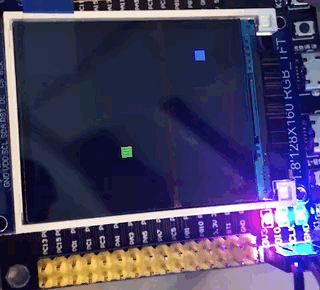
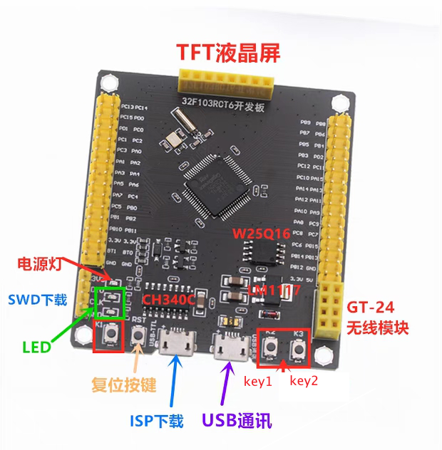
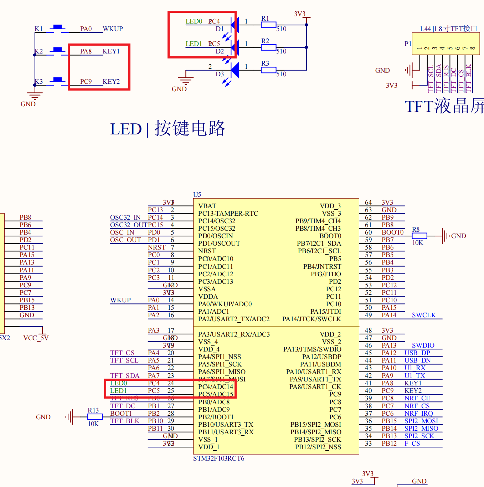
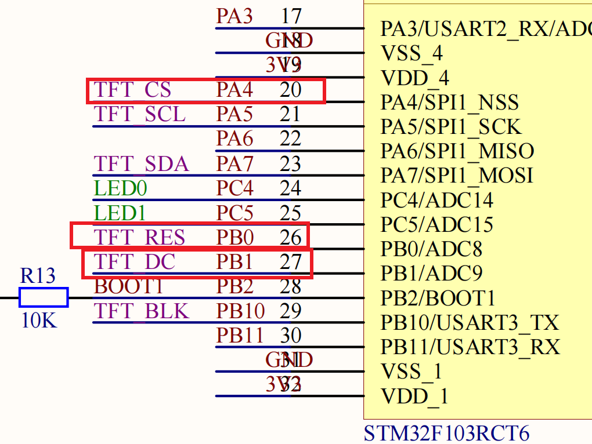

# stm32-Snake-Game

一个基于 stm32 开发的贪吃蛇小游戏，仅通过两个按钮按键实现对蛇方向的操作。




## 游戏玩法

对蛇方向的操作通过按键按 `KEY1` 或 `KEY2` 实现对蛇转向。

请注意蛇头方向向左转则按 `KEY`1，向右转则按 `KEY2`




## 材料
- STM32F103RC 最小系统板子
- TFT ST7735S 屏幕
- DAPLINK 烧录
- vscode + platformio + Arduino + TFT库 + cpp

## 如何开始

> 由于本人电脑非 Windows 操作系统，所以使用 vscode 加插件 platformio 来进行嵌入式开发，对于烧录，由于电脑问题不能使用ISP烧录，因此买了个 DAPLINK 进行 cmsis-dap 烧录。

如果你的 stm32 板子跟我的不一样，也没关系，因为我用的是 Arduino 框架，你只需要在 `main.cpp` 修改以下内容：
```cpp
/* LED Pin，具体看板子原理图 */
const int LED_PIN0 = PC4;
const int LED_PIN1 = PC5;

/* Button Pin */
const int KEY1 = PA8;
const int KEY2 = PC9;

/* TFT Pin */
const int CS = PA4;
const int DC = PB1;
const int RST = PB0; // RESET 命名冲突了

/* TFT screen size 160x128 */
const int WIDTH = 160;
const int HEIGTH = 128;
```


以及修改 `platformio.ini` 里相关参数：
```shell
[env:genericSTM32F103RC]
platform = ststm32
board = genericSTM32F103RC
framework = arduino
upload_protocol = cmsis-dap   # 看你选择烧录的方式：stlink, jlink ...
```


## 相关问题

> 如果发现烧录后 TFT 屏幕一直白屏，没有效果

**注意引脚设置，如果发现烧录后一直没反应，一直是白屏，插上另一个 USB 尝试供电，RESET 按键试试！！！**

> 为什么我在 platformio 里没搜索到 TFT 这个库

>> https://www.arduino.cc/reference/en/libraries/tft/

>> Allows drawing text, images, and shapes on the Arduino TFT graphical display.

>> This library is compatible with most of the TFT display based on the ST7735 chipset.

>> Go to repository

>> Note: this library was retired and is no longer maintained.

因为已经停用维护了，需要自己去仓库下载导入 https://github.com/arduino-libraries/TFT

> 我用的是不同的 stm32 型号，我要如何使用？

先自己创建 pio 项目，选择对应的 `board` 和 框架 `Arduino`，之后生成 `platformio.ini`，根据生成的内容修改本仓库中的 `platformio.ini`，就可以愉快完事了。

> 为什么用的是 TFT 这个库？

因为很多教程都是使用这个 TFT 库，为了简便省事就用这个了。

> DAPLINK 的线路是怎么连的？

看你自己的板子 4pin SWD 里写的标识符，用杜邦线将 DAP 和板子带有相同标识符一一连接起来。

比如 DAP 里写的是 3v3，而板子也有 3v3，就用线连起来。

> 不知道如何看原理图？

LED 和 KEY 引脚：


TFT 引脚：


## bug

- [] 会出现蛇头移动到下一格时，蛇尾还未移动，造成咬到蛇尾的问题

- [] 会出现按钮抖动问题