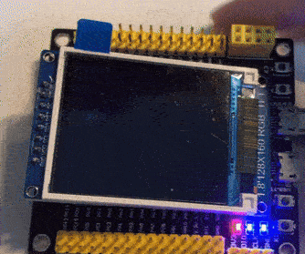
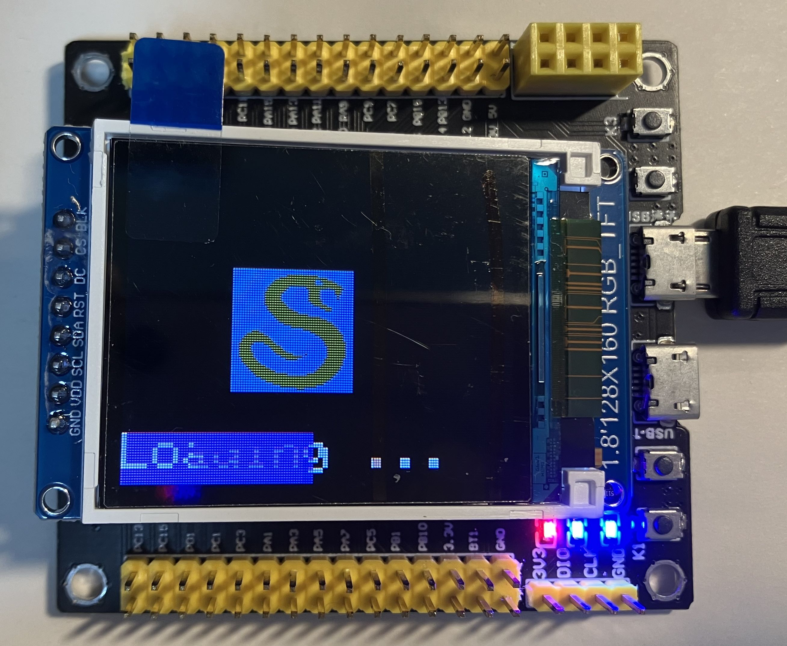
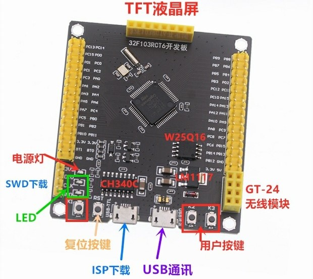

# stm32-Snake-Game

一个基于 stm32 开发的贪吃蛇小游戏，仅通过两个按钮按键实现对蛇方向的操作。





## 游戏玩法

- 对蛇方向的操作通过按键按 `KEY1` 或 `KEY2` 实现对蛇转向。
- 请注意蛇头方向向左转则按 `KEY1`，向右转则按 `KEY2`



## Feature

- 两个按键实现蛇左右转向
- 蛇可跨越地图边界
- 由 Input-Update-Render 三模块设计实现
- 局部渲染，针对蛇头、蛇尾和食物渲染
- 可设置并控制游戏帧率

## 材料
- STM32F103RC 最小系统板子
- TFT ST7735S 屏幕
- DAPLINK 烧录
- vscode + platformio + Arduino + TFT库 + cpp

## 如何开始

如果你使用的也是 Arduino 框架，对于不同的板子，你只需要修改 `config.h` 中相关的引脚值。

以及修改 `platformio.ini` 里相关参数：
```ini
[env:genericSTM32F103RC]
platform = ststm32
board = genericSTM32F103RC
framework = arduino
upload_protocol = cmsis-dap   # 选择烧录方式：stlink, jlink ...
```

## 相关问题

<details>
  <summary>烧录后 TFT 屏幕一直白屏，没有效果</summary>
  注意引脚设置，如果发现烧录后一直没反应，一直是白屏，插上另一个 USB 尝试供电，RESET 按键试试！
</details>

<details>
  <summary>为什么我在 platformio 里没搜索到 TFT 这个库</summary>
  Allows drawing text, images, and shapes on the Arduino TFT graphical display.This library is compatible with most of the TFT display based on the ST7735 chipset.Go to repository.
  
  Note: this library was retired and is no longer maintained.

  因为已经停用维护了，需要自己去仓库下载导入 https://github.com/arduino-libraries/TFT
</details>

<details>
  <summary>我用的是不同的 stm32 型号，我要如何使用？</summary>
  先自己创建 pio 项目，选择对应的 board 和 框架 Arduino，之后生成 platformio.ini，根据生成的内容修改本仓库中的 platformio.ini，就可以愉快完事了。
</details>

<details>
  <summary>DAPLINK 的线路是怎么连的？</summary>
  看你自己的板子 4pin SWD 里写的标识符，用杜邦线将 DAP 和板子带有相同标识符一一连接起来。
  比如 DAP 里写的是 3v3，而板子也有 3v3，就用线连起来。
</details>

<details>
  <summary>不知道如何看原理图？</summary>

  LED 和 KEY 引脚：
  

  TFT 引脚：
  
</details>

<details>
  <summary>如何调试输出</summary>
  这里我们使用的是 Serial 来进行调试输出内容，在使用前需要先 Serial.begin()，
  之后则是 Serial.print()。
  
  需要注意的是，我们连接 USB，并开启 ENABLE_USB_SERIAL，并启用 Serial Monitor 接收。详细内容请自行翻阅代码。
</details>

## TODO

- [x] 重构项目，由 Input-Update-Render 三个模块重新设计实现
